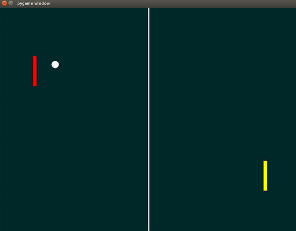
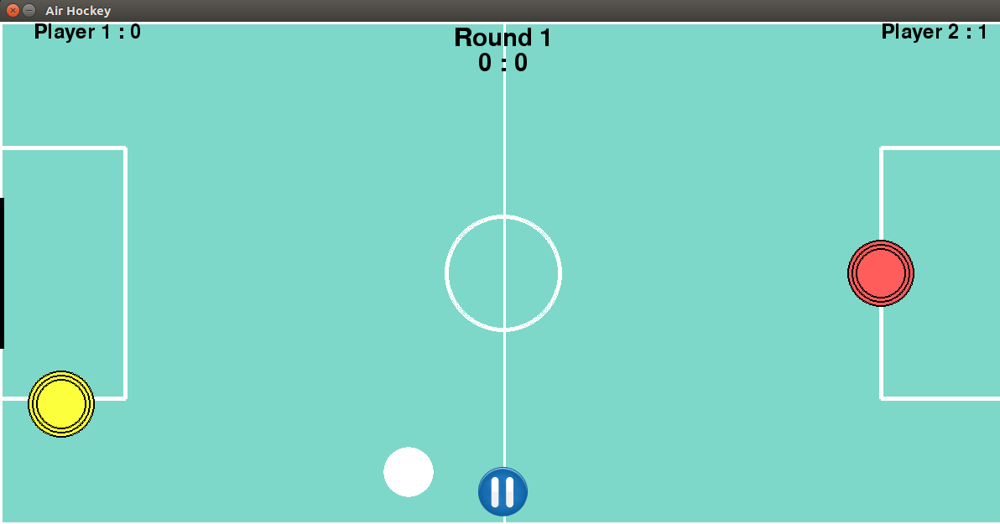

## About Kharaghpur Winter of Code

Kharagpur Winter of Code is a 5-week long online programme for the students, who are new to open source software development. The programme not only helps students to get involved in open source, but also preps them for many open source summer programmes, Google Summer of Code being one of them.

## About me

Hello, my name is Yash Kothari, I am an undergraduate student at _University Visvesvaraya College of Engineering_, Bangalore. I am in my second year of engineering at the time of writing this blog. I have always been fascinated by open source projects, but I could never get myself to contribute to these projects as they were too large for me, atleast thats what I felt. KWoC has given me an excellent oppurtunity to get familiar with basics of how open source projects work on a small scale where I feel I can contribute and learn new things at the same time. It has been a wonderful 5 week programme.

### Projects

Selecting a project has always been a hard part for me, I was looking for a project which uses a technology stack that I am familiar with and at the same time it should encourage me to learn new things. After spending some time going through the list of [https://kwoc.kossiitkgp.in/projects](projects) available, I decided to work on projects using _python_ and dealing with games. [https://github.com/NITDgpOS/AirHockey](Air Hockey) and [https://github.com/jajodiaraghav/Snake](Snake) were the main projects I contributed to. I also contributed to [https://github.com/aribis369/Whats-in-the-news-GEEK](Whats in the news Geek) and [https://github.com/mubaris/motivate](motivate).

#### Air Hockey

The project was to make a _pygame_ application for the classic game _Air Hockey_. When I started working on the project it had a simple game logic that whenever the puck hit the paddle it would result in the x and y velocity of the puck changed to opposite sign. I noticed that this did not seem natural and started working on improving the collision physics. I found an article which had a phycics tutorial related to collision between two circular objects, following the tutorial I made the required changes and had a resonable collision physics in place. It was the first time I had a meaningful contribution to any project, it felt good. After that I kept fixing various bugs and improving the game, its wonderful to see how far the game has come from when I started working on it.

 to 

#### Snake

This was another project which used _pygame_ to replicate the classic _Snake_ game. This project made me realize how important organizing/refactoring code into smaller blocks can help remove redundancy and improve readability. My first contribution to this project was to refactor the code to use classes and objects. It was the first time I had used _object oriented_ paradigm of programming using _python_. In addition to this I also fixed few bugs.

### Summary

Kharaghpur Winter of Code was a wonderful experience, I would like to thank [https://github.com/jajodiaraghav](Raghav Jajodia) and [https://github.com/Aniq55](Aniq Ur Rahman) the mentors for the projects, it was great working with them. I would have loved to contribute more to these projects and many more but had my semester exams during that period. All in all I think KWoC, is an excellent way for a novice to get started in open source projects.
